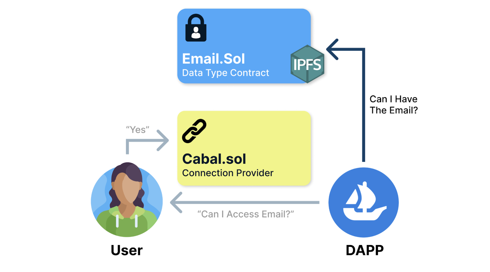

# How it works

### Walkthrough on how our User interacts with dAPPs

- User traditionally gets prompted with a form to enter in details

- Using the old traditional system of a sign up form a company can simply just store your data
  
- Some Web2 companies don't even allow a User to view their content if they don't give access to certain data fields (for signup etc..)
  
- We decided to tackle this issue by intropducing a Web3 Authentication standard which will allow a User to decide which data fields to provide a company and allow them to revoke access to certain fields whenever they would like - thus "owning" their data.
  
- The way this works is that the User saves their sensitive information only once in a encrypted Data Type Contract, which then gets stored in IPFS.
  
- Now when a DAPP or a company goes to ask a User if they can access a certain data field, a User can sign off on the request which goes to the connection provider
  
- Now the DAPP goes to the Data Contract to ask for the data once the User signs off
  
- The Contract checks in now with the connection provider to see if the User can actually access the email. If the User signed the Email will be returned.
  
- If the User did not sign this will revoke access to the specific field or return an error from the contract.
  
